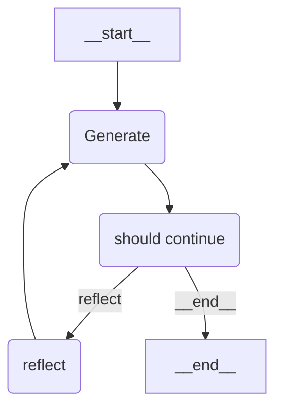

# reflection-agent

`Chains` concept applied to this example repository:

- generation_chain
- reflect_chain

## Utilities

Initialize project with `poetry`:
```sh
poetry init
```

Install dependencies:
```sh
poetry add python-dotenv black isort langchain langchain-openai langgraph
```

To check if the `.env` is being imported, evaluate the following expression:
```python
import os
...
os.environ['OPENAI_API_KEY']
```

## Environment
Here is the template for the `.env` file:
```
OPENAI_API_KEY=<API Key from openai>
LANGCHAIN_API_KEY=<API Key from langsmith>
LANGCHAIN_TRACING_V2=true
LANGCHAIN_PROJECT=<name that will show up in the langsmith dashboard>
```